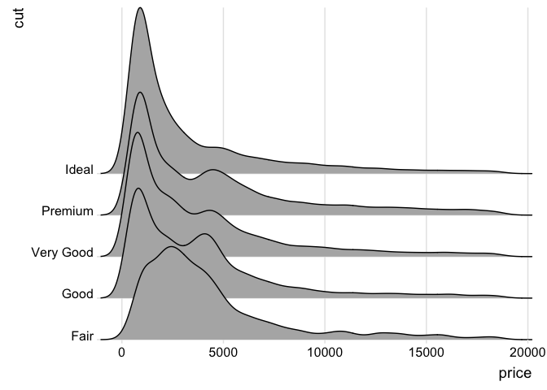

<!-- README.md is generated from README.Rmd. Please edit that file -->
ggridges
========

[](https://travis-ci.org/clauswilke/ggridges) [](https://codecov.io/github/clauswilke/ggridges?branch=master) [](https://CRAN.R-project.org/package=ggridges) [](http://cranlogs.r-pkg.org/downloads/total/last-month/ggridges)

Geoms to make ridgeline plots using ggplot2, written by Claus O. Wilke

This package has now been officially relased on CRAN. Most things should work as expected, and the API should now be relatively stable. For feedback and feature requests, please open issues on github.

About ridgeline plots
---------------------

Ridgeline plots are partially overlapping line plots that create the impression of a mountain range. They can be quite useful for visualizing changes in distributions over time or space. These types of plots have also been called ["joyplots"](https://twitter.com/JennyBryan/status/856674638981550080), in reference to the [iconic cover art](https://blogs.scientificamerican.com/sa-visual/pop-culture-pulsar-origin-story-of-joy-division-s-unknown-pleasures-album-cover-video/) for Joy Division's album *Unknown Pleasures*. However, given the [unfortunate origin](https://en.wikipedia.org/wiki/House_of_Dolls) of the name Joy Division, the term "joyplot" is now discouraged.

Installation
------------

Stable release:

``` r
install.packages("ggridges")
```

Latest development version:

``` r
library(devtools)
install_github("clauswilke/ggridges")
```

Usage
-----

``` r
library(ggplot2)
library(ggridges)
    
ggplot(diamonds, aes(x = price, y = cut)) +
  geom_density_ridges(scale = 4) + theme_ridges() +
  scale_y_discrete(expand = c(0.01, 0)) +   # will generally have to set the `expand` option
  scale_x_continuous(expand = c(0, 0))      # for both axes to remove unneeded padding
#> Picking joint bandwidth of 458
```



Documentation and Examples
--------------------------

First read the [package vignette.](https://cran.r-project.org/web/packages/ggridges/vignettes/introduction.html) Then read the [reference manual.](https://cran.r-project.org/web/packages/ggridges/ggridges.pdf)
